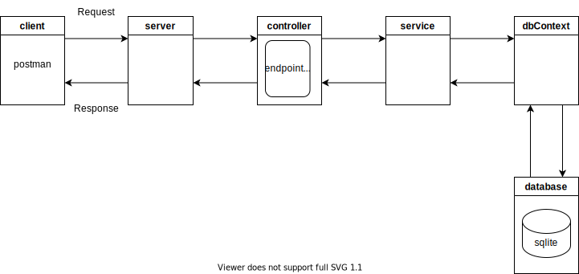

# express-js-mongodb-promise-api

A simple rest api using asp.net core and sqlite

## Requirements

* .Net 6.0 SDK ([https://dotnet.microsoft.com/en-us/download/dotnet/6.0](https://))
* VS Code (optional) ([https://marketplace.visualstudio.com/items?itemName=ms-dotnettools.csharp](https://))
* Postman (optional for testing api)
* SQLiteStudio (optional for managing database) ([https://sqlite.org/index.html](https://))

## Diagram



## Components

* **appSettings (appSettings.json)**

  - configuration file
* **Server (Program.cs)**

  - creates/configure server and listens on a port 5053
* **Controller (TaskController.cs)**

  - handles routing requests (endpoint routing)
* **Service (TaskService.cs)**

  - handles business logic
* **Model (TaskModel.cs and ServiceResponse.cs)**

  - models for data
* **DbContext (DbContext.cs)**

  - handles db connection
* **database (sqlite)**

  - sqlite database

## Run

Run the following command from the root directory:

```
dotnet run
```

## Tests

Try the following urls in Postman.

* GetTasks (GET)

  * http://127.0.0.1:5053/api/tasks
* GetTask (GET)

  * http://127.0.0.1:5053/api/tasks/1
* AddTask (POST)

  * http://127.0.0.1:5053/api/tasks
  * body -> raw, json
  * { "id" : "1", "name": "task1", "description": "task1", "priority": "low", "status": "none" }
* UpdateTask (PUT)

  * http://127.0.0.1:5053/api/tasks/1
  * body -> raw, json
  * { "id" : "1", "name": "task11", "description": "task11", "priority": "medium", "status": "started" }
* DeleteTask (DELETE)

  * http://127.0.0.1:5053/api/tasks/1
  * body -> raw, json
  * { "id" : "1" }
